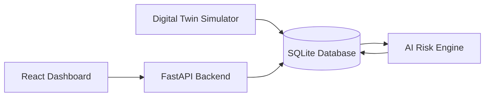
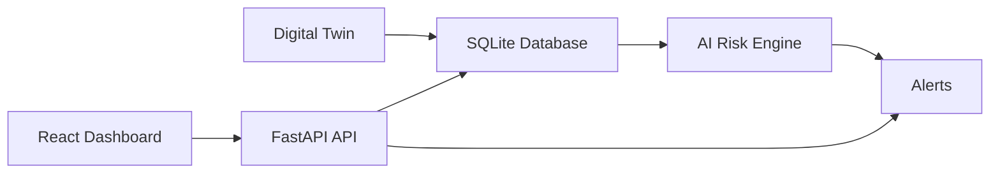
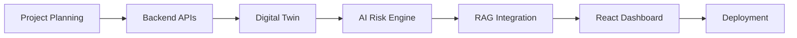

# PermitGhost

> AI-Powered Industrial Safety Intelligence Platform

PermitGhost is an intelligent industrial safety platform designed to identify hazardous operational conditions before they become industrial accidents.

Unlike conventional Permit-to-Work (PTW) systems that validate permits independently, PermitGhost continuously reasons over the complete operational state of an industrial facility. It combines environmental conditions, equipment health, worker activity and permit status to detect dangerous combinations and generate explainable safety alerts.

The current implementation includes a real-time Digital Twin, live sensor simulation, a FastAPI backend and an explainable AI risk assessment engine.

---

# Project Status

PermitGhost is currently under active development for the **Economic Times AI Hackathon 2026**.

| Module | Status |
|---------|--------|
| Repository Setup | Complete |
| System Design | Complete |
| FastAPI Backend | Complete |
| SQLite Database | Complete |
| REST APIs | Complete |
| Digital Twin Simulation | Complete |
| AI Risk Engine | In Progress |
| Knowledge Retrieval (RAG) | Planned |
| React Dashboard | Planned |
| Deployment | Planned |

---

# Motivation

Industrial accidents are rarely caused by a single failure. Instead, they occur when several independent operational events overlap.

For example, consider a refinery where welding is being performed while a minor gas leak develops nearby. Maintenance workers enter the same area and a cooling pump begins to malfunction. Individually, each event may appear acceptable. Together, however, they create conditions that can rapidly escalate into a major accident.

Most existing Permit-to-Work systems verify whether a permit has been approved and whether mandatory documentation has been completed. They do not continuously evaluate changing operational conditions after the permit becomes active.

PermitGhost introduces an AI-powered safety intelligence layer that continuously monitors the evolving plant state and identifies hazardous combinations before they result in incidents.

---

# System Overview

PermitGhost models an industrial refinery as a continuously evolving Digital Twin. Each operational zone maintains environmental sensor readings, equipment status, worker occupancy and permit activity.

The backend continuously updates this simulated plant state, stores it in a database and exposes it through REST APIs. The AI Risk Engine analyses the current operational state, generates explainable safety alerts and provides recommendations for corrective action.



---

# Current Features

PermitGhost currently provides:

- Real-time Digital Twin simulation across multiple industrial zones
- Continuous simulation of temperature, humidity, gas concentration and pressure
- Equipment health monitoring
- Worker occupancy simulation
- Active Permit-to-Work tracking
- Explainable AI-based risk scoring
- REST APIs built with FastAPI
- SQLite persistence layer
- Interactive Swagger API documentation

---

# Digital Twin

The Digital Twin represents a virtual refinery consisting of multiple operational zones including tank farms, boiler rooms, loading bays and control rooms.

Each zone maintains its own operational state, including:

- Environmental sensor readings
- Equipment condition
- Worker occupancy
- Active permits
- Operational events
- Current risk level

Unlike random data generators, the Digital Twin maintains a persistent plant state that evolves over time, enabling realistic simulation of industrial operations.

---

# AI Risk Assessment

PermitGhost uses an explainable rule-based AI engine to evaluate operational risk.

Instead of producing opaque predictions, the engine analyses multiple safety indicators including gas concentration, temperature, equipment condition, worker density and permit activity before assigning an overall risk score.

Each generated alert includes:

- Severity level
- Confidence score
- Explanation of contributing factors
- Recommended mitigation actions

This design ensures every decision remains transparent and auditable.

---

# Repository Structure

```text
PermitGhost/

├── backend/
│   ├── main.py
│   ├── api.py
│   ├── database.py
│   ├── models.py
│   ├── schemas.py
│   ├── digital_twin.py
│   ├── ai_engine.py
│   ├── services.py
│   ├── config.py
│   ├── seed.py
│   └── requirements.txt
│
├── frontend/
│
├── data/
│
├── docs/
│
└── README.md
```

---

# Current Backend Workflow



---

# Development Roadmap



---

# Demonstration Workflow

During a demonstration, the Digital Twin continuously simulates refinery operations across multiple industrial zones.

Environmental conditions, worker activity and permit status evolve over time. As hazardous situations emerge, the AI Risk Engine evaluates the plant state, assigns a risk level and generates explainable alerts together with mitigation recommendations.

The React dashboard visualises the current plant state and displays all active safety alerts in real time.

---

# Future Work

Future development will focus on extending PermitGhost into a production-ready industrial safety platform by introducing:

- Retrieval-Augmented Generation (RAG) using industrial safety manuals
- Multi-agent AI reasoning
- MQTT and IoT sensor integration
- SCADA integration
- Computer vision for worker localisation
- Predictive accident forecasting
- Regulatory compliance reporting
- Real-time notification systems

---

# License

This project is licensed under the MIT License.