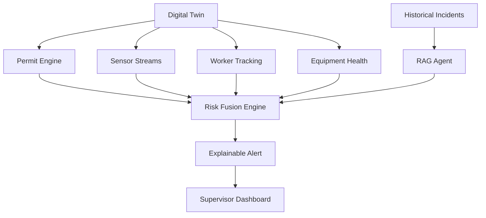
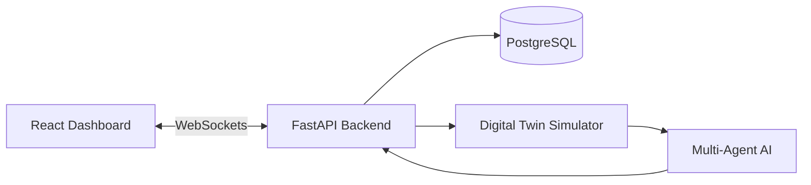
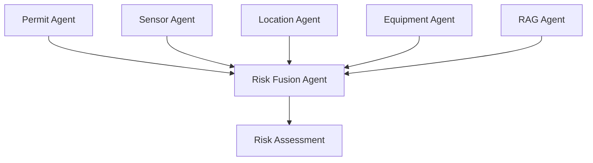
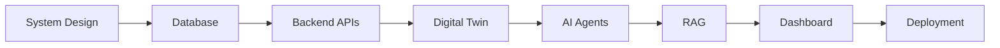

# PermitGhost

> AI-Powered Industrial Safety Intelligence Platform

PermitGhost is an intelligent industrial safety platform that detects dangerous compound risks by continuously analysing work permits, live process data, worker locations, equipment status and historical incidents. Instead of validating permits independently, the system reasons about the entire plant as a continuously evolving environment and identifies hazardous combinations before they become accidents.

---

# Project Status

PermitGhost is currently under active development for the **Economic Times AI Hackathon 2026**.

| Module | Status |
|---------|--------|
| Repository Setup | ✅ |
| System Design | ✅ |
| Backend | 🚧 |
| Digital Twin | ⏳ |
| AI Engine | ⏳ |
| Dashboard | ⏳ |

---

# Motivation

Industrial accidents rarely occur because of a single failure. More often, they emerge from multiple independent events interacting in unexpected ways.

Consider a refinery where welding is taking place near a storage tank while a small gas leak begins to develop. At the same time, workers enter the area for maintenance and a nearby cooling pump unexpectedly fails. Each event appears acceptable when viewed independently, yet together they create a situation with severe consequences.

Most Permit-to-Work (PTW) systems only verify whether a permit has been approved and whether mandatory fields have been completed. They do not continuously correlate permits with live operating conditions, worker movements or previous incidents.

PermitGhost aims to provide this missing intelligence layer.

---

# System Overview

The platform constructs a Digital Twin of an industrial plant and continuously updates it using simulated operational data. Multiple AI agents analyse different aspects of plant operations before combining their observations into a single explainable risk assessment.



---

# Architecture

PermitGhost is divided into four major subsystems.

The backend is responsible for permit management, data ingestion and communication with the frontend. The Digital Twin continuously simulates the industrial environment and generates realistic events. The AI Engine consumes these events using multiple specialised agents before producing an explainable risk assessment. Finally, the React dashboard visualises the current state of the plant and all active alerts.



---

# Multi-Agent Architecture

Instead of relying on a single reasoning model, PermitGhost divides responsibility across specialised agents.

Each agent focuses on one aspect of industrial safety before passing its findings to the Risk Fusion Agent.



---

# Core Components

## Digital Twin

The Digital Twin represents a virtual refinery containing workers, equipment, permits and environmental sensors. Rather than replaying historical data, it continuously generates realistic industrial scenarios including equipment failures, worker movement, gas leaks and maintenance operations. This provides a dynamic environment in which the AI system can be evaluated without requiring access to confidential industrial datasets.

## Multi-Agent AI

PermitGhost employs a collaborative reasoning approach in which each agent specialises in a different domain such as permit analysis, sensor interpretation, equipment monitoring or historical incident retrieval. A fusion agent combines these observations into a single risk assessment together with an explanation and recommended mitigation strategy.

## Explainable Alerts

Every alert generated by the platform includes a description of the detected hazard, the reasoning behind the decision, supporting historical evidence and suggested corrective actions. This allows supervisors to understand why a recommendation has been made instead of receiving only a numerical risk score.

---

# Repository Structure

```text
PermitGhost/

├── backend/
├── frontend/
├── ai_engine/
├── digital_twin/
├── data/
├── docs/
├── tests/
└── scripts/
```

---

# Development Roadmap



---

# Demonstration Workflow

The demonstration begins by launching the Digital Twin, which creates a virtual refinery populated with workers, equipment and active work permits. As simulated operations continue, sensor readings evolve over time and maintenance activities begin to overlap.

When hazardous conditions emerge—for example, hot work occurring near a gas leak—the AI agents independently analyse permits, sensor readings and historical incidents before the fusion engine generates an explainable compound-risk alert. The dashboard visualises the affected area and presents recommendations before work is allowed to continue.

---

# Future Work

Future versions of PermitGhost will focus on integrating live SCADA systems, computer vision for worker localisation, wearable IoT devices, predictive accident forecasting and regulatory audit generation. Long-term, the goal is to evolve PermitGhost into a comprehensive AI-powered safety intelligence platform capable of assisting industrial facilities in preventing accidents before they occur.

---

# License

This project is licensed under the MIT License.
